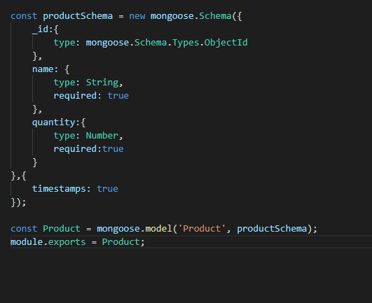

# INVENTRY
This is a repository Made in Coding Ninjas Mock Test 1.

## Index
  - [Product Features](#product-feautres)
  - [Schemas](#schemas)
  - [EndPoints](#end-points)
  - [Setup](#setup)

## Product Features
- An Admin can create a new product, update products, view all  products and can delete them.
- Used mongoDB to store the data.
- Used Mongoose Schemas to manage the database.
- Added Postman Collections and MongoDump as well.

## Schemas
- Product Schema 

## End Points
- POST `/products/create`  For Creating New Product 
- GET `/products` For Getting all Products 
- POST `/products/:id/update_quantity` For Updating Quantity of the Product
- DELETE `/products/:id` For Deleting Product

## Setup
- In the terminal, run `git clone https://github.com/shivamyth/ManageInventory.git `.
- run `npm i`.
- run `npm start`.
- Now You are set to go!
